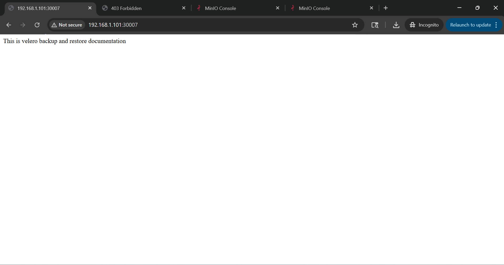
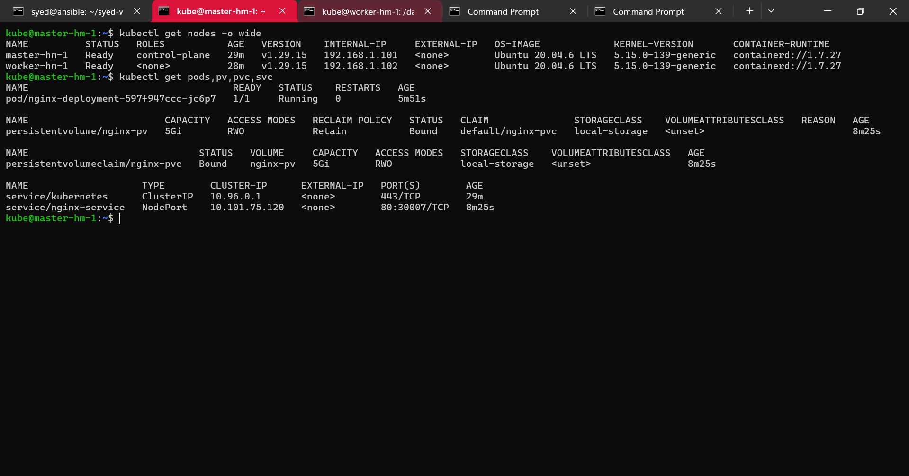
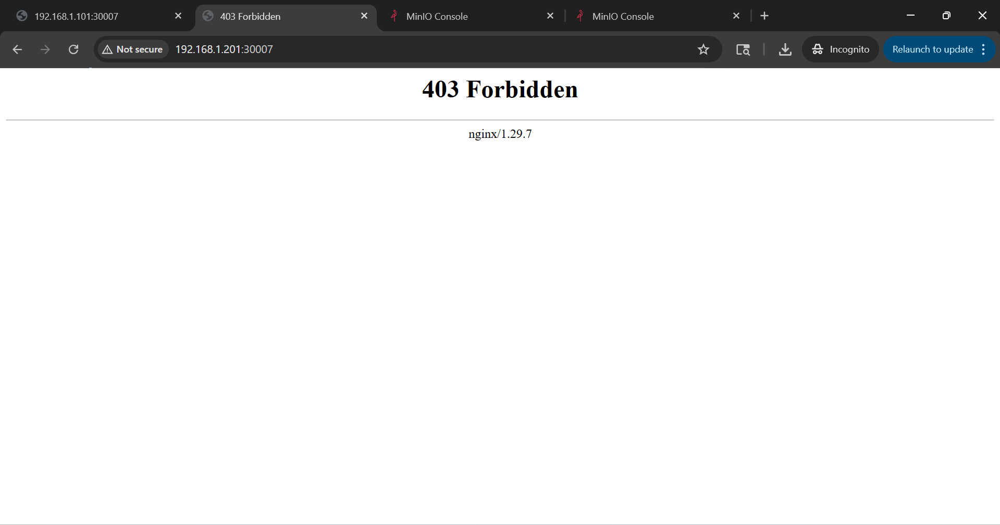
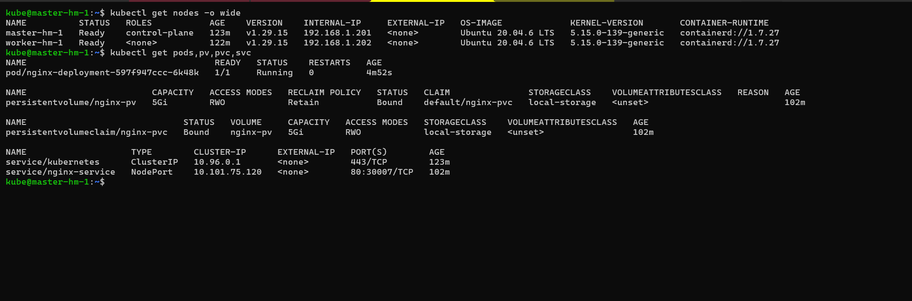
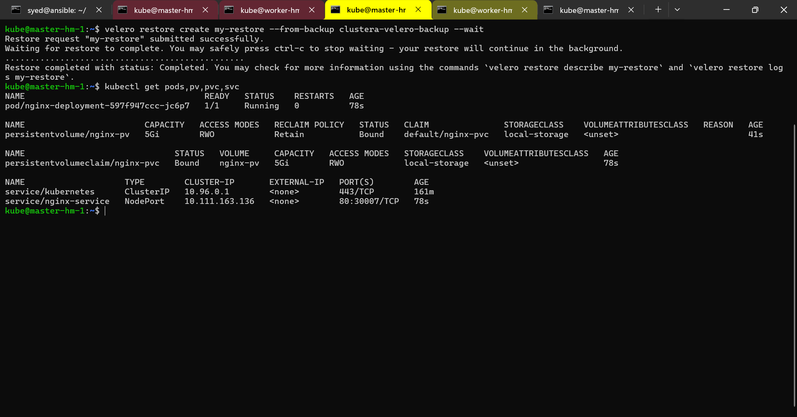
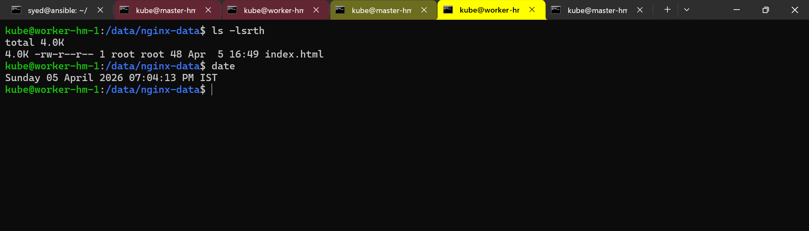
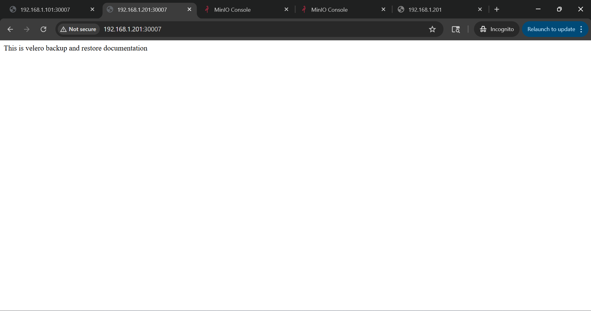

# Velero Backup and Restore: 

---

## 1. Overview

This document provides an end-to-end guide to backup and restore Kubernetes clusters using **Velero** and **etcd snapshots**, including **Persistent Volume (PV) data restoration**.

Two clusters are considered in this guide:

| Cluster   | Master Node IP | Worker Node IP |
| --------- | -------------- | -------------- |
| Cluster-A | 192.168.1.101  | 192.168.1.102  |
| Cluster-B | 192.168.1.201  | 192.168.1.202  |

---

## 2. Cluster-A Setup

### 2.1 Nodes Status

```bash
kubectl get nodes -o wide
```

| NAME        | STATUS | ROLES         | VERSION  | INTERNAL-IP   |
| ----------- | ------ | ------------- | -------- | ------------- |
| master-hm-1 | Ready  | control-plane | v1.29.15 | 192.168.1.101 |
| worker-hm-1 | Ready  | <none>        | v1.29.15 | 192.168.1.102 |

### 2.2 Install etcd-client

```bash
sudo apt install etcd-client -y
```

---

## 3. Nginx Deployment with PV and PVC

### 3.1 Deployment YAML

```yaml
apiVersion: apps/v1
kind: Deployment
metadata:
  name: nginx-deployment
spec:
  replicas: 1
  selector:
    matchLabels:
      app: nginx
  template:
    metadata:
      labels:
        app: nginx
    spec:
      containers:
        - name: nginx
          image: nginx:latest
          volumeMounts:
            - name: nginx-storage
              mountPath: /usr/share/nginx/html
      volumes:
        - name: nginx-storage
          persistentVolumeClaim:
            claimName: nginx-pvc
---
apiVersion: v1
kind: PersistentVolume
metadata:
  name: nginx-pv
spec:
  capacity:
    storage: 5Gi
  accessModes:
    - ReadWriteOnce
  storageClassName: local-storage
  persistentVolumeReclaimPolicy: Retain
  local:
    path: /data/nginx-data
  nodeAffinity:
    required:
      nodeSelectorTerms:
        - matchExpressions:
            - key: kubernetes.io/hostname
              operator: In
              values:
                - worker-hm-1
---
apiVersion: v1
kind: PersistentVolumeClaim
metadata:
  name: nginx-pvc
spec:
  accessModes:
    - ReadWriteOnce
  storageClassName: local-storage
  resources:
    requests:
      storage: 5Gi
---
apiVersion: v1
kind: Service
metadata:
  name: nginx-service
spec:
  type: NodePort
  selector:
    app: nginx
  ports:
    - port: 80
      targetPort: 80
      nodePort: 30007
```

### 3.2 Node Preparations

```bash
kubectl label node worker-hm-1 node-type=worker-hm-1
sudo mkdir -p /data/nginx-data
```

### 3.3 Apply Manifest

```bash
kubectl apply -f deployment.yaml
```

### 3.4 Add Content to Nginx

```bash
sudo sh -c 'echo "This is velero backup and restore documentation" > /data/nginx-data/index.html'
```

**Browser Verification:**
`http://192.168.1.101:30007/`



---

## 4. Velero Installation on Cluster-A

### 4.1 Download and Install

```bash
wget https://github.com/vmware-tanzu/velero/releases/download/v1.18.0/velero-v1.18.0-linux-amd64.tar.gz
tar -xvf velero-v1.18.0-linux-amd64.tar.gz
sudo mv velero-v1.18.0-linux-amd64/velero /usr/local/bin/
velero version
```

### 4.2 Create MinIO Credentials

```bash
cat <<EOF > credentials-velero
[default]
aws_access_key_id=GRHM26LSzyY8vi8ozETq
aws_secret_access_key=m5azVDZj328IfjtVAFyT26E1rXp5EjwrJfXOn8Of
EOF
```

### 4.3 Velero Install Command

```bash
velero install \
  --provider aws \
  --plugins velero/velero-plugin-for-aws:v1.8.0 \
  --bucket velero-backup \
  --secret-file ./credentials-velero \
  --use-volume-snapshots=false \
  --use-node-agent \
  --uploader-type kopia \
  --backup-location-config region=minio,s3ForcePathStyle="true",s3Url=http://192.168.1.101:9000
```

**Verify Velero Pods:**

```bash
kubectl get pods -n velero
```

| NAME                    | READY | STATUS  |
| ----------------------- | ----- | ------- |
| node-agent-bh7qx        | 1/1   | Running |
| velero-6598c86fbd-n96nl | 1/1   | Running |

---

## 5. Backup Cluster-A

```bash
velero backup create clustera-velero-backup \
  --include-namespaces default \
  --default-volumes-to-fs-backup \
  --snapshot-volumes=false \
  --wait
```

**Check Backup Status:**

```bash
velero get backup
```

| NAME                   | STATUS    | STORAGE LOCATION |
| ---------------------- | --------- | ---------------- |
| clustera-velero-backup | Completed | default          |

---

## 6. ETCD Backup on Cluster-A

```bash
sudo ETCDCTL_API=3 etcdctl snapshot save /home/kube/etcd-snapshot/clustera-etcd-snapshot.db \
  --cacert=/etc/kubernetes/pki/etcd/ca.crt \
  --cert=/etc/kubernetes/pki/etcd/server.crt \
  --key=/etc/kubernetes/pki/etcd/server.key
```



---

## 7. Cluster-B Setup and Etcd Restore

### 7.1 Install etcd-client

```bash
sudo apt install etcd-client -y
```

### 7.2 Restore ETCD Snapshot

```bash
sudo ETCDCTL_API=3 etcdctl snapshot restore clustera-etcd-snapshot.db \
  --name master \
  --initial-cluster master=https://192.168.1.201:2380 \
  --initial-cluster-token etcd-cluster-1 \
  --initial-advertise-peer-urls https://192.168.1.201:2380 \
  --data-dir /var/lib/etcd

sudo kubeadm init --ignore-preflight-errors=DirAvailable--var-lib-etcd
```

### 7.3 Worker Node Join

```bash
kubeadm join <master-join-command>
```

### 7.4 Verify Cluster Resources

```bash
kubectl get nodes -o wide
kubectl get pods,pv,pvc,svc
```

**Browser Verification:**
`http://192.168.1.201:30007/` → Shows `403 Forbidden`



> Note: ETCD restore restores only Kubernetes resources, **not PV data**.


---

## 8. Velero Restore on Cluster-B

### 8.1 Delete Existing Resources Before Restore

```bash
kubectl delete deployment.apps/nginx-deployment
kubectl delete persistentvolumeclaim/nginx-pvc
kubectl delete persistentvolume/nginx-pv
kubectl delete service/nginx-service
```

### 8.2 Create PV Manifest

Reapply the PV manifest manually.

## Velero installation in Cluster-B

- Follow the steps which we have used in `Cluster-A` setup.

### 8.3 Restore Velero Backup

**Check Backup Status:**

```bash
velero get backup
```

| NAME                   | STATUS    | STORAGE LOCATION |
| ---------------------- | --------- | ---------------- |
| clustera-velero-backup | Completed | default          |

```bash
velero restore create my-restore --from-backup clustera-velero-backup --wait
```

**Browser Verification:**
`http://192.168.1.201:30007/` → Shows restored content







---


